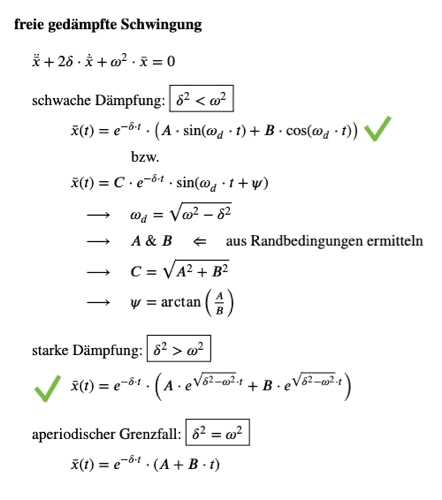

# !!! notable changes since v1.1 (as of v1.3) !!!
- mistake in "Kälteprozess" drawing: 3 -> 4 is isenthalpic
  
- missing "+"-signs  
  in "6.3 Impuls & Stoß" > "Stoß" > energy equation
  
- missing parentheses  
  in "6.4 Schwingungen" > "freie gedämpfte Schwingung" > "schwache Dämpfung" > x(t)=...
- unintentional text 'subitem'  
  in "6.4 Schwingungen" > "freie gedämpfte Schwingung" > "starke Dämpfung"
  

# HTL_TMB-Formelsammlung
HTL-Neufelden 2023  
TMB = "Technische Mechanik und Berechnung"  
Teacher: Dipl.-Ing. S. Bernhard

## Authors
- used [template](https://github.com/wch/latexsheet) (by Winston Chang)
- content heavily inspired by unknown former HTL student
- adjusted and corrected by E. Reisinger, T. Rabeder & V. Mahringer
- written in TeX by T. Mittermair
